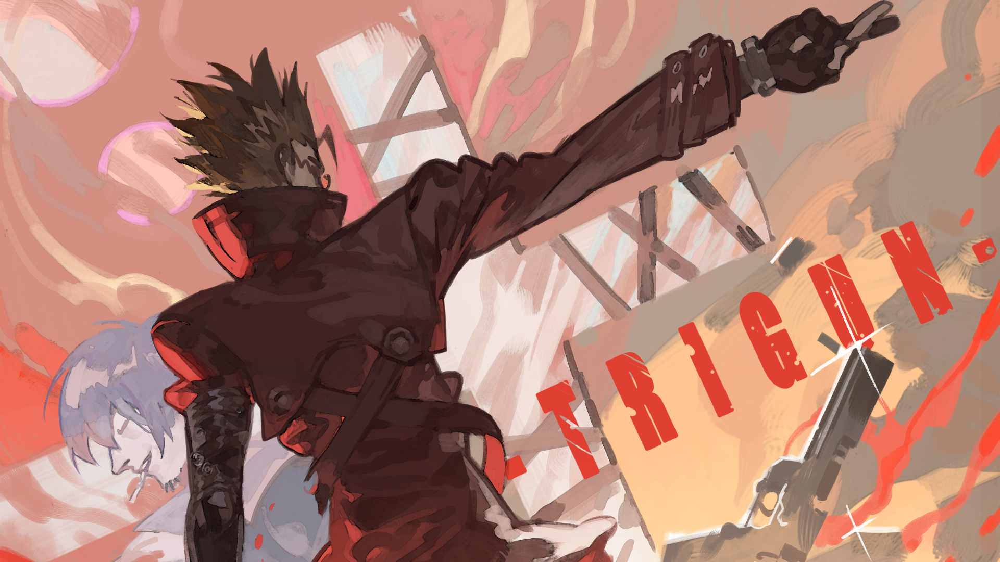

# DOTFILES

My riced Hyprland + Arch Linux configuration.

## Demo

[](https://www.youtube.com/watch?v=EckhSjf67jQ)

---

## What's Included

| Config | Description |
|--------|-------------|
| `hypr` | Hyprland, keybinds, autostart, scripts |
| `waybar` | Status bar with custom warm red/orange theme |
| `rofi` | App launcher + screenshot theme |
| `kitty` | Terminal |
| `cava` | Audio visualizer |
| `wlogout` | a logout screen for wayland |
| `Termsonic` | a TUI for any sonic api music servers|
| 'hyprpolkitagent'|a polkit agent for hyprland |

### Themes

Themes live in `./themes/` and are applied via the rofi theme-switcher (`Super + w`).
Each theme includes a wallpaper, waybar style, and Hyprland border colors.

| Theme | Preview |
|-------|---------|
| Arch |  |
| Miku |  |
| Vash |  |

---

## Installation

### Automatic (recommended)

```bash
git clone https://github.com/EasyCanadianGamer/DOTFILES.git
cd DOTFILES
./install.sh
```

The script will:
- Check for Arch Linux and Hyprland
- Install required packages via `pacman` and `yay`
- Copy configs to `~/.config/`
- Copy themes to `~/.local/share/themes/`
- Set Arch as the default wallpaper theme

### Manual

1. Install packages:
```bash
sudo pacman -S --needed hyprland wayland awww cava kitty waybar rofi dunst pwvucontrol
yay -S --needed wlogout
```

2. Copy configs:
```bash
cp -r .config/. ~/.config/
cp -r themes/. ~/.local/share/themes/
```

3. Set a default wallpaper:
```bash
echo "$HOME/.local/share/themes/Arch/wallpaper.png" > ~/.cache/current-wallpaper
```

---

## Post-Install

- **SDDM theme** must be installed manually: [sddm-astronaut-theme](https://github.com/Keyitdev/sddm-astronaut-theme)
- Log out and back in (or reboot) after installing
